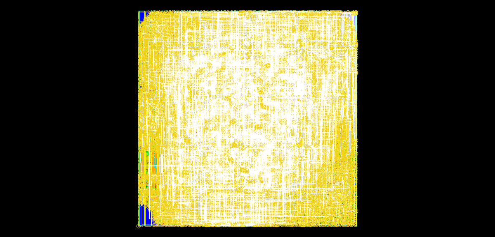
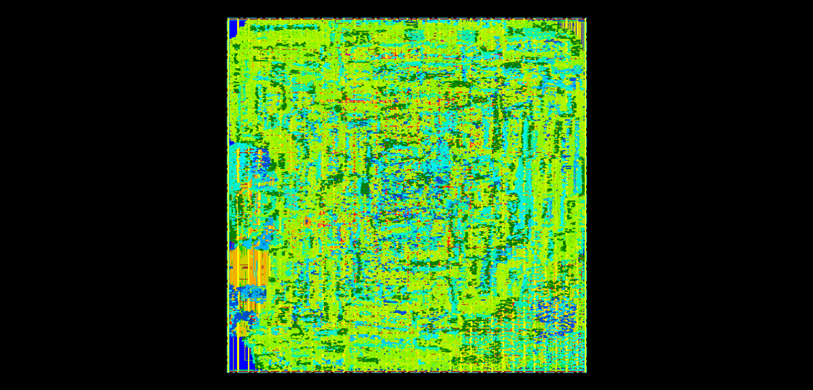

# Physical layout #

After the synthesis stage, physical layout was performed using Cadence Encounter, according to the guidelines from lab sessions, plus some added steps for Clock Tree Synthesis:

- for power grid distribution, the two top layers were reserved for the two power rings (Vdd and GND) and a certain number of power stripes; 
- placement has been performed with default options (see below); note that the buffers inserted along the Reset tree by Design Compiler have been placed by Design Compiler in such a way that the path delay was minimized (at least according to the pre-route wire length estimates, which are based on the line-of-sight distance between components)
- Clock Tree Synthesis (CTS) has been performed; in this phase, Encounter has been instructed to insert new buffers (or inverters) choosing from a prepared subset of the technology library, and place them optimally; buffer insertion was carried out 
- Two-phase routing (TrialRoute and NanoRoute) has been performed, aiming for timing optimization.
- filler cells were added to help the front-end phase of the production process: this ensures that each row has continuous N-wells and P-wells wherever possible.

Results of the layout phase are attached to this report.

## Critical path ##

Unfortunately, the resulting layout has a large negative slack of -12ns, due to the fact that the placement tool placed the Data Memory very far from the ALU output register (as it can be seen from the attached Encounter post-route timing report);

This means that the clock frequency of the final design can go up to 50MHz (around 20ns clock period).

Timing results could greatly be improved by either:

- explicitly guiding the placement of the memory block near to the ALU output;
- repeating physical layout starting from a synthesis result targeted for 2ns; this would start from a version more aggressively optimized for timing, and even with the delays introduced by Encounter, 8ns should be within reach (although total power consumption would surely be increased).

